# WARSEED AI 与基础决策树设计

> 状态：设计基线（面向规则 AI 的下一阶段实现）  
> 最后更新：2026-08-05  
> 适用范围：玩家方 AI 下属、敌方 AI、任务仲裁、难度系统、调试与验收

## 1. 文档目的

本文定义 WARSEED 的 AI 产品边界和可落地实现方案。目标不是制造一个能够绕过规则的“万能电脑”，而是建立一套：

- 玩家可以理解、授权、暂停和接管的我方指挥组织；
- 只使用合法阵营知识、但能形成经济和军事压力的敌方指挥系统；
- 敌我双方复用命令、移动、战斗、生产、建造和维修规则的基础决策框架；
- 可以通过参数而不是作弊形成明显差异的难度档；
- 在 10 Hz 权威模拟中可复现、可测试、可诊断的规则 AI。

本文把能力标记为三个阶段：

| 标记 | 含义 |
|---|---|
| **现有** | 当前仓库已经具备，可作为后续实现基础 |
| **下一阶段** | 应优先进入下一轮开发与测试 |
| **长期** | MVP 稳定后再引入，不应阻塞基础 AI |

首轮实现状态（2026-08-05）：数据化四档难度、我方四级授权及菜单、权限命令门禁、自主工业/战场基础任务、合法情报目标评分、路线风险、目标切换滞回、攻击追击上限、撤退双阈值、观察后兵种反制、工作流权限摘要和调试决策原因已经落地。多编队任务图、完整资源预留、巡逻/护卫、前后排战术和策略画像仍属于后续阶段。

## 2. 设计原则与经典 RTS 启发

WARSEED 不复制某一款游戏的内部 AI，而是吸收成熟 RTS 的共同原则：

| 参考方向 | 可借鉴原则 | WARSEED 中的落点 |
|---|---|---|
| 《魔兽争霸 III》 | 单位有明确职责；防守围绕威胁地点；攻击需要追击、集火、撤退和重新集结 | 战术状态机、角色过滤、局部威胁图、追击上限 |
| 《星际争霸》 | 侦察信息决定生产反制；进攻依赖兵力窗口；多线压力比无脑正面冲锋更重要 | 敌情记忆、兵种需求、战役任务、困难档多编队 |
| 《红色警戒》 | 生产和扩张节奏清楚；骚扰经济线；基地受袭时快速回防 | 经济预算、矿车骚扰、基地防御中断、生产模板 |
| 《帝国时代》 | 经济单位安全、资源点争夺、扩张地点选择影响中期局势 | 矿区价值评分、护航、撤离、扩张风险评分 |

由此得到六条硬规则：

1. **公平信息**：AI 只能读取本阵营快照，不能读取隐藏单位的当前位置、生命和命令。
2. **同规则执行**：AI 只能提交合法 `GameCommand`，不能直接修改权威状态。
3. **先有目标，再有任务，最后才有单位命令**：战略层不逐 tick 操纵单个单位。
4. **玩家最终控制**：玩家直接命令始终高于我方 Agent 命令，且接管必须可见、可恢复。
5. **可解释**：每个重要决策保留原因、使用的信息、预算和退出条件。
6. **稳定优于聪明表象**：使用冷却、滞回、最低驻留时间和承诺成本，防止反复改令。

## 3. 与现有权威架构的关系

固定执行链保持不变：

```text
Player Input / Friendly Agent / Enemy Agent
                     |
                     v
                GameCommand
                     |
                     v
             CommandValidator
                     |
                     v
               CommandQueue
                     |
                     v
        SimulationWorld (10 Hz authority)
                     |
                     v
        WorldSnapshot / SimulationEvent
                     |
                     v
             Presentation / HUD
```

AI 的输出必须是意图或命令，不能是结果。例如：

- 合法：提交 `ProduceUnitCommand` 请求生产突击车；
- 非法：直接向阵营增加一辆突击车；
- 合法：提交 `AttackCommand` 攻击可见目标或前往最后已知位置；
- 非法：读取隐藏目标坐标并持续追踪；
- 合法：提交 `BuildBuildingCommand` 并等待工程车施工；
- 非法：直接把建筑设为完工。

AI 逻辑必须只依赖权威 tick。随机选择使用带对局种子的确定性随机源，使同样输入可以重放。

## 4. AI 总体分层

双方 AI 共用相同的四层结构，只是权限来源和目标不同。

| 层级 | 建议频率 | 责任 | 输出 |
|---|---:|---|---|
| 战略层 | 每 20—50 tick | 选择发展方向、攻防比例、策略模板 | 战略目标、预算、优先级 |
| 战役/任务层 | 每 5—15 tick | 创建任务、组建编队、选择地区和路线 | 任务图、单位申请、资源预留 |
| 战术层 | 每 2—5 tick | 接敌、集火、阵型、追击、撤退 | Move/Attack/Defend 等命令 |
| 单位安全层 | 每 tick | 脱困、避让、近距自卫、目标失效恢复 | 最小必要的安全命令 |

上层不得频繁推翻下层已经承诺的工作。任务除非遇到以下事件，否则至少保持一个最低驻留时间：

- 基地受到紧急威胁；
- 目标已摧毁、失联超时或变得非法；
- 编队损失超过撤退阈值；
- 玩家接管了关键成员；
- 路线连续失败；
- 预算或生产前提永久失效。

## 5. AI 可使用的信息

### 5.1 阵营知识快照

每个 AI 只接收其阵营的只读 `FactionSnapshot`，建议包含：

- 己方单位、建筑、资源、生产和任务状态；
- 当前 `VISIBLE` 的敌方单位和建筑；
- `EXPLORED` 区域中的最后已知接触记录；
- 已探索地形、阻挡、矿区和己方测得的威胁；
- 命令成功、失败、受阻、单位死亡、建筑受袭等事件；
- 已公开的游戏规则数据，例如单位造价、射程、建造时间和克制标签。

不提供：

- `UNEXPLORED` 区域内容；
- 隐藏敌军的实时位置、生命、任务和生产队列；
- 敌方当前资源；
- 尚未被侦察确认的建筑；
- 从展示节点推断出的额外权威信息。

### 5.2 接触记忆

每条敌方接触记录建议保存：

```text
entity_id / type_id / role_tags
last_seen_position / last_seen_tick
last_seen_health_ratio
observed_velocity / observed_heading
confidence (0..1)
estimated_threat / estimated_value
```

置信度随时间衰减：

```text
confidence = initial_confidence * exp(-age_ticks / memory_half_life)
```

AI 可以前往最后已知位置搜索，但到达且未重新发现目标后必须清除或显著降低置信度，不能继续追踪隐藏真值。

## 6. 我方 AI 的权限设计

### 6.1 授权档位

玩家应能按 Agent 或领域选择授权档位：

| 档位 | AI 可以做什么 | AI 不可以做什么 |
|---|---|---|
| `ADVISORY` 建议 | 生成建议、风险提示和预估成本 | 提交任何会改变世界的命令 |
| `ASSISTED` 协助 | 执行玩家明确创建的任务，处理路径、补员和局部战术 | 扩展任务目标或主动花费未授权资源 |
| `DELEGATED` 委托 | 管理指定领域、编队、预算和地区；创建必要子任务 | 越过领域边界或动用未分配单位 |
| `AUTONOMOUS` 自主 | 在玩家设定的战略方针和预算上限内主动创建任务 | 改变胜利目标、解除玩家接管或突破硬限制 |

MVP 推荐默认值：主 AI 为 `ADVISORY`，工业主管和战场将领为 `ASSISTED`；玩家主动开启“全权副官”后，指定领域升为 `DELEGATED`。`AUTONOMOUS` 应在任务图、资源预留和解释 UI 完成后开放。

### 6.2 不可逾越的控制优先级

从高到低：

```text
玩家紧急命令 / Stop
玩家直接单位命令
玩家显式创建的高层任务
主 AI 分配的领域任务
主管 Agent 创建的子任务
单位安全行为
空闲默认行为
```

玩家直接命令命中 Agent 管理单位时：

1. 单位立即进入 `TEMPORARILY_OVERRIDDEN`；
2. 原任务保留该单位的成员记录，但不能继续向其下令；
3. 如果任务仍有足够成员则降级继续，否则转为 `BLOCKED`；
4. HUD 显示接管原因和原任务；
5. 只有玩家执行 `RETURN` 或显式重新委托，单位才能归队；
6. AI 不得通过超时自动夺回单位。

### 6.3 领域权限

| Agent | 默认领域 | 可管理对象 | 典型动作 |
|---|---|---|---|
| 主 AI / 参谋长 | 跨域协调 | 目标、优先级、预算、主管任务 | 分解目标、仲裁冲突、提出建议 |
| 工业主管 | 经济与工程 | 矿车、工程车、生产建筑、经济预算 | 采矿、生产、施工、维修、扩张 |
| 战场将领 | 侦察与作战 | 侦察车、突击车、导弹车、战斗预算 | 侦察、防守、护卫、袭击、进攻 |

单位是否可参与任务由数据标签决定，而不是由单位名字硬编码：

```text
HARVESTER -> harvest, self_defend
ENGINEER  -> build, repair, retreat
SCOUT     -> scout, attack_move, screen
ASSAULT   -> attack, defend, escort, frontline
MISSILE   -> attack, defend, backline, siege
```

混合选择或混合任务下发时，每个子命令只包含兼容单位；矿车和工程车不会因为全军攻击而中断工作。

## 7. 我方任务模型与仲裁

### 7.1 任务最小结构

```text
task_id
issuer_id / owner_agent_id / faction_id
kind / domain / priority
authorization_level
target_entity_id / target_position / radius
participant_ids / requested_roles
resource_budget / reserved_ore
prerequisites / child_task_ids
phase / lifecycle / blocked_reason
created_tick / minimum_commit_until_tick / deadline_tick
success_conditions / abort_conditions
decision_reason
```

### 7.2 任务图

一个高层目标应分解为有依赖关系的任务，而不是单一状态枚举。例如“攻击敌方指挥中心”：

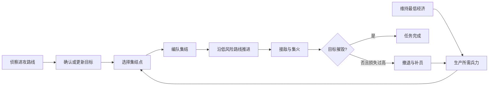

同一时刻允许工业、侦察和作战任务并行；是否冲突取决于资源、单位、建筑槽位和空间占用，而不是仅按“同领域”一刀切。

### 7.3 资源预留

建议把资源分为四个虚拟预算池，实际扣款仍由权威经济系统执行：

| 预算池 | 用途 | 默认优先级 |
|---|---|---:|
| 生存 | 补矿车、关键维修、基地紧急防御 | 100 |
| 经济 | 扩张、工程、生产设施 | 70 |
| 作战 | 作战单位、前线支援 | 60 |
| 机会 | 临时反制、追击窗口、低风险扩张 | 40 |

预留不是凭空扣除资源，而是防止低优先级任务抢走高优先级计划所需的矿石。命令提交前仍须由 `CommandValidator` 验证真实余额。

### 7.4 冲突仲裁

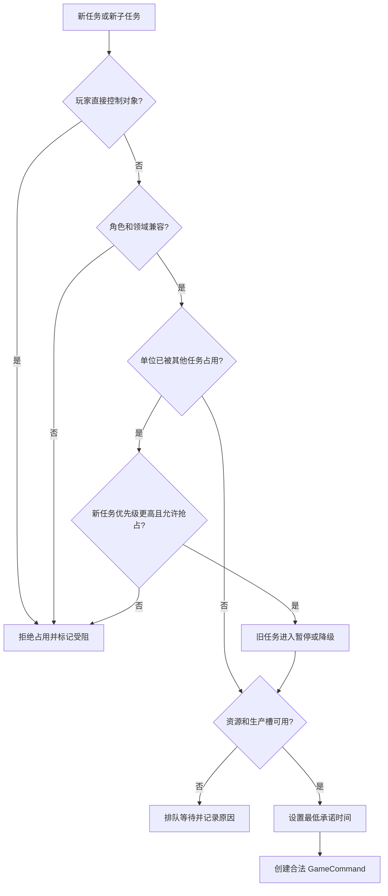

抢占仅允许发生在 Agent 管理对象之间。已经施工的工程车、正在卸矿的矿车和正在撤离危险区的单位具有短期不可抢占窗口。

## 8. 我方 AI 决策树

### 8.1 主 AI / 参谋长

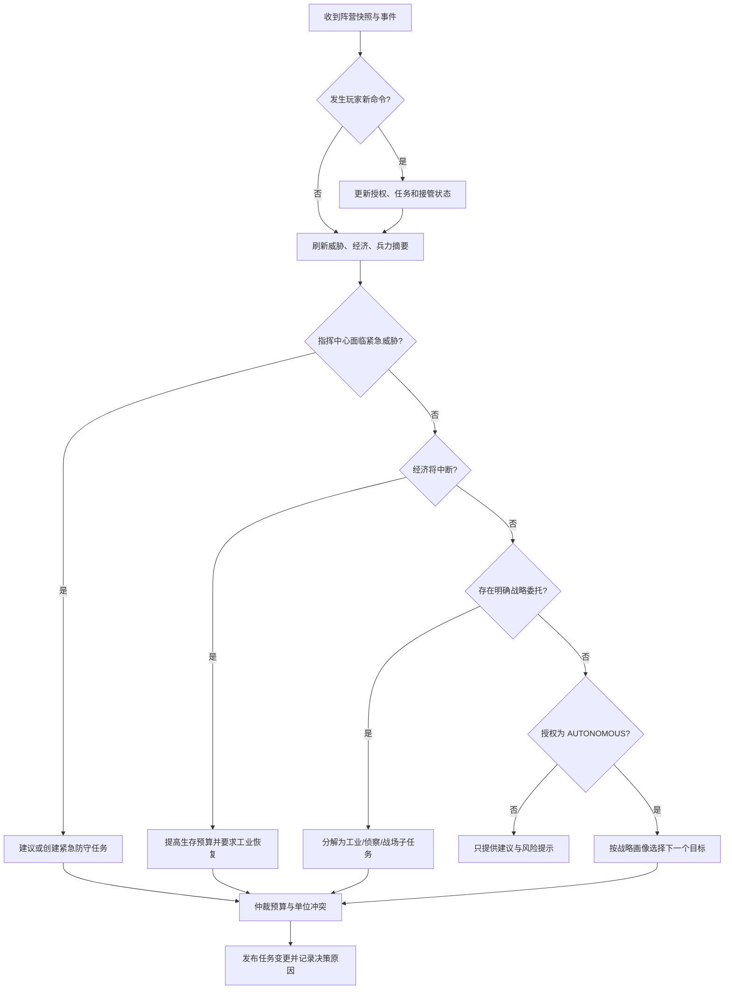

紧急威胁判定建议同时满足“价值”和“时限”：敌军预计在防御响应时间内能攻击指挥中心、生产建筑或集中矿车，且可见威胁分超过阈值。

### 8.2 工业主管

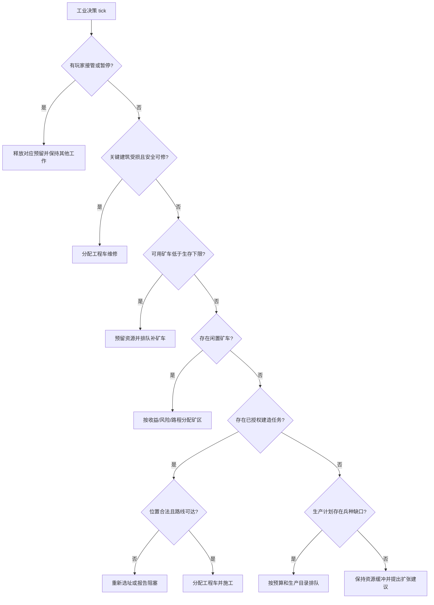

矿区评分：

```text
ore_score = expected_yield
          - round_trip_time * time_weight
          - route_threat * threat_weight
          - congestion * congestion_weight
          + friendly_support * support_weight
```

单个矿车收到玩家采矿命令时，只改变该车的工作，不应重派其他矿车。

### 8.3 战场将领

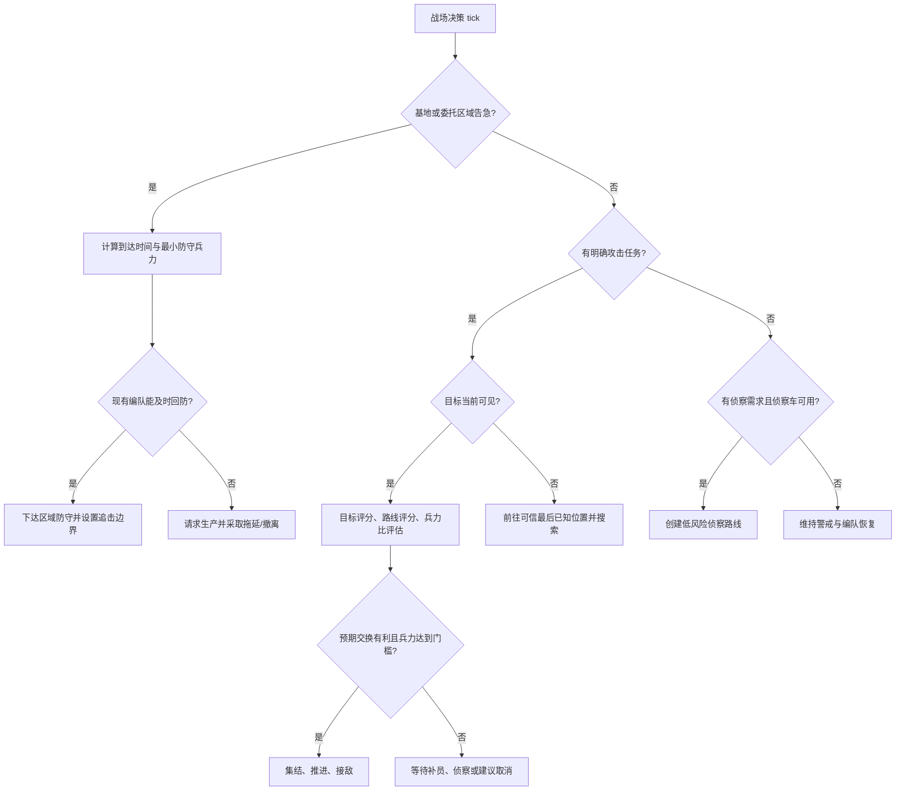

## 9. 敌方 AI 架构

### 9.1 从八阶段状态机演进

**现有** `EnemyRaidAgent` 已覆盖：

```text
ECONOMY -> EXPANSION -> SCOUTING -> CONTESTING
        -> MUSTERING -> RAIDING -> RETREATING -> DEFENDING
```

它已经能补充经济单位、维修、建支援站、按基地威胁回防、按生命撤退并按兵种缺口生产。下一阶段不应删除这条稳定路径，而应把它改造成“战略模板 + 可并行任务”的兼容层：

```text
现有 Phase
  -> 提供默认战略意图和最低成功路径
  -> Task Planner 创建经济、侦察、防守、袭击任务
  -> Tactical Controller 分别控制各编队
```

这样 Easy 仍可近似沿固定阶段运行，Hard/Expert 则能在同一战略下并行侦察、守矿和进攻。

### 9.2 敌方战略状态

敌方顶层应使用可中断但带滞回的状态：

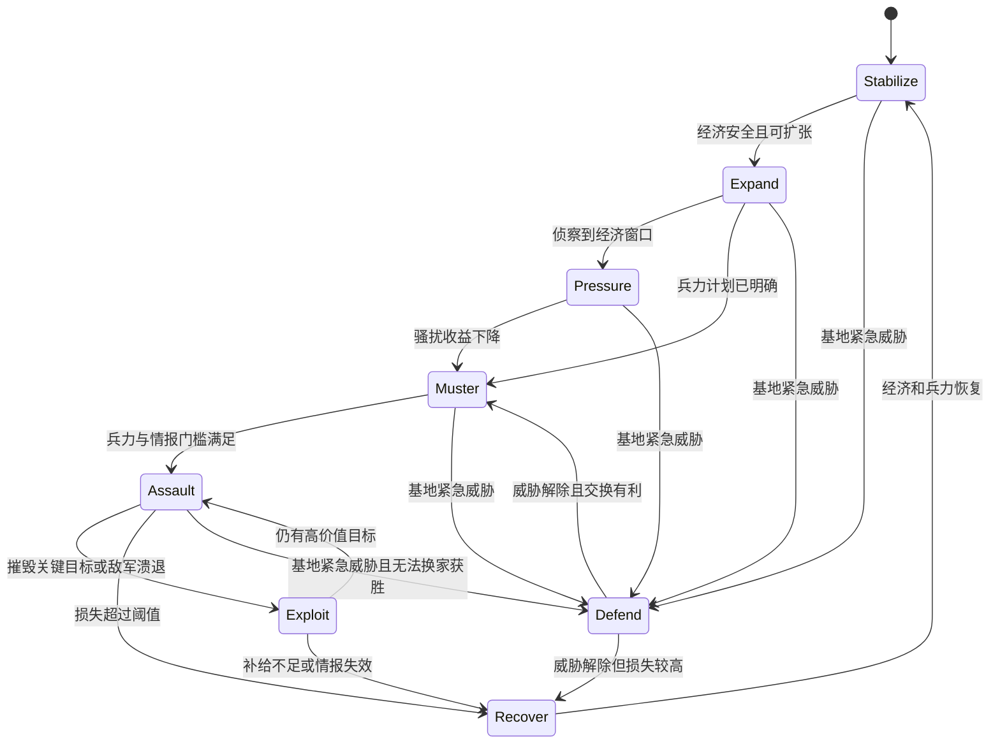

所有状态都可以维持后台经济；战略状态控制的是预算倾向和任务优先级，不应让矿车因进入 `Assault` 而停止采矿。

## 10. 敌方总决策树

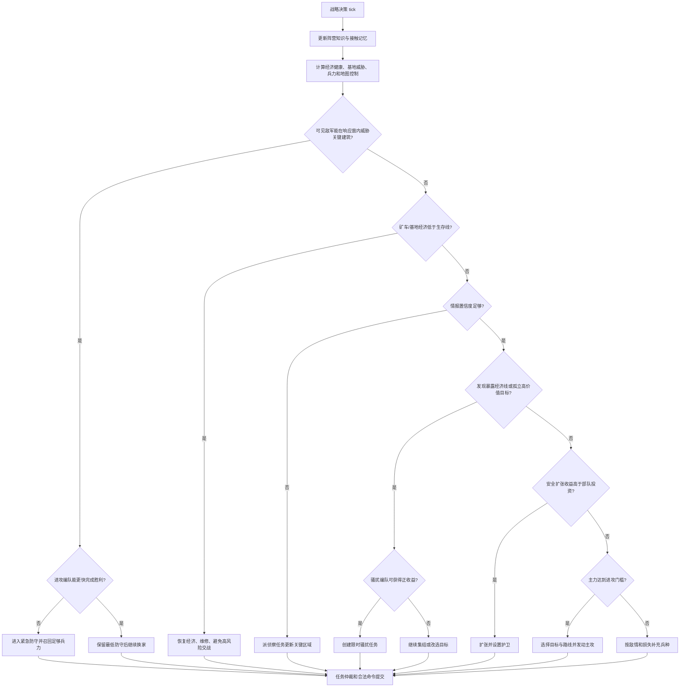

## 11. 敌方子决策树

### 11.1 经济与生产

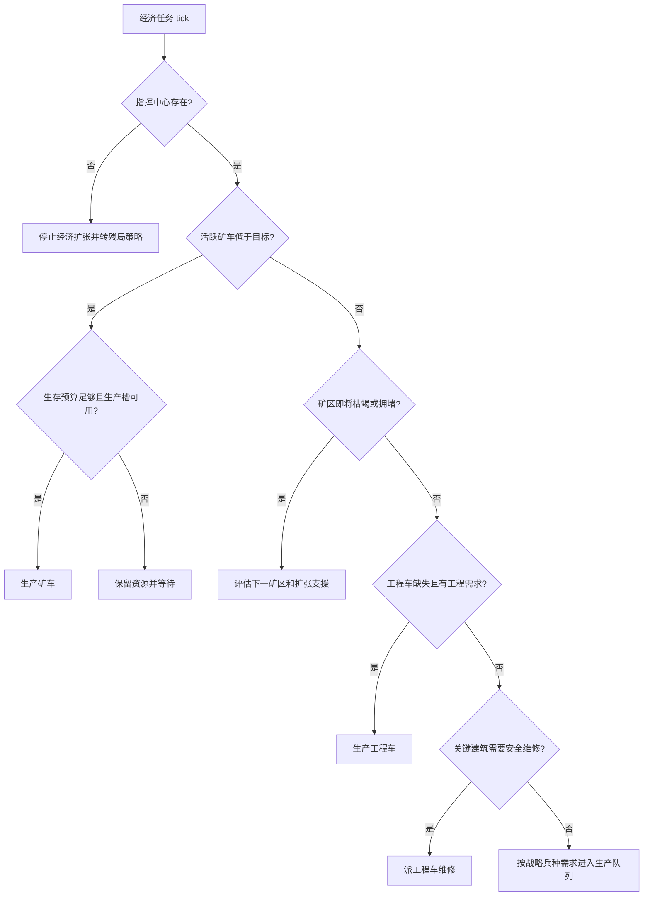

生产需求不直接等于“最贵单位最好”，建议计算：

```text
need(type) = desired_ratio_gap
           + observed_counter_value
           + replacement_urgency
           + task_requirement
           - queue_delay
           - ore_opportunity_cost
```

### 11.2 扩张

候选扩张点评分：

```text
expansion_score = ore_value
                + map_control_gain
                + support_overlap
                - builder_travel_time
                - observed_route_threat
                - enemy_arrival_advantage
                - footprint_risk
```

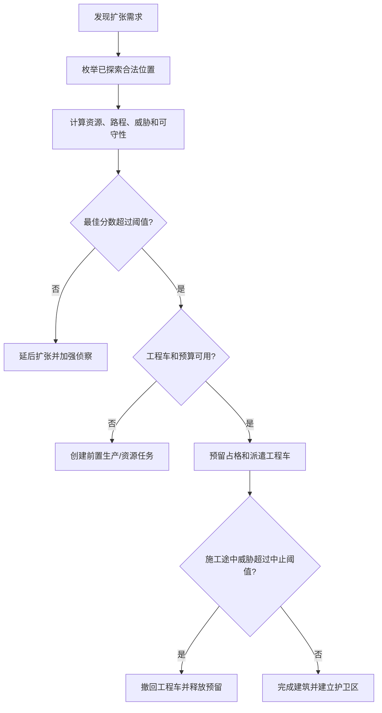

### 11.3 侦察

侦察不是在固定点间无限循环，而是填补信息缺口：

```text
scout_value(cell) = strategic_relevance
                  * information_age
                  * uncertainty
                  - route_risk
                  - revisit_penalty
```

优先区域依次为：敌方可能扩张点、通往己方基地的进攻通道、敌方生产区、争夺矿区、长期未更新的最后接触点。

侦察车决策：

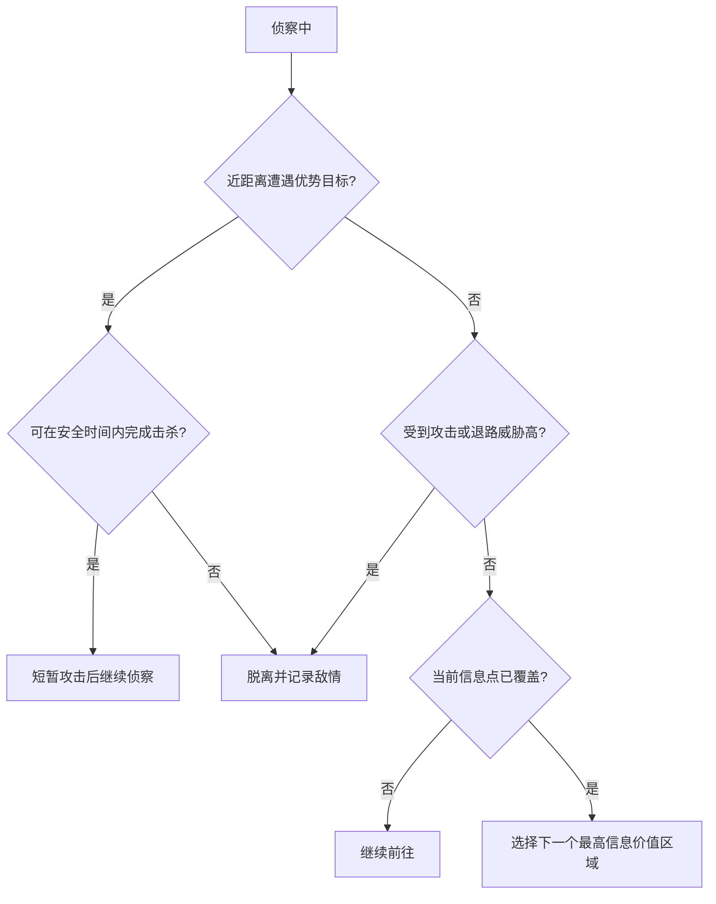

### 11.4 基地防守

防守需求按威胁到关键资产的预计时间计算：

```text
defense_urgency = asset_value
                * visible_threat_power
                * arrival_probability
                / max(time_to_contact, 1)
```

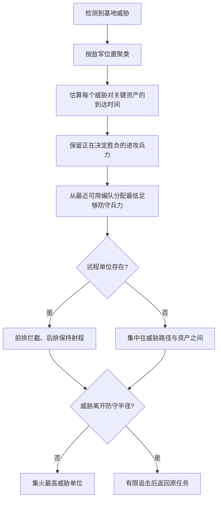

防守地点必须是命令参数。防守单位可以在半径内接敌，但追出半径加缓冲区后必须回到防区，避免被单个侦察车引走。

### 11.5 骚扰

优先目标：暴露矿车、孤立工程车、低血生产建筑、远离主力的远程单位。骚扰任务必须限时且有明确退出条件。

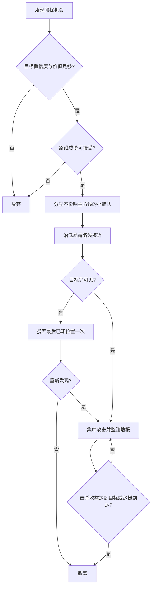

### 11.6 主攻、追击与撤退

发起主攻的基础条件：

```text
own_effective_power >= estimated_enemy_power * required_power_ratio
AND information_confidence >= minimum_attack_confidence
AND economy_reserve >= minimum_survival_reserve
AND route_score >= minimum_route_score
```

目标评分：

```text
target_score = strategic_value
             + threat_reduction
             + expected_economic_damage
             + opportunity
             - travel_cost
             - expected_losses
             - uncertainty
             - objective_risk
```

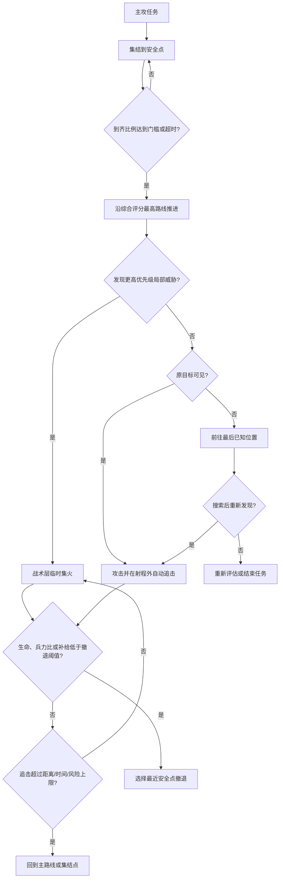

撤退采用双阈值滞回：低于 `retreat_enter_ratio` 才撤退，恢复到更高的 `retreat_exit_ratio` 才允许重新进攻。例如 0.42 进入撤退、0.68 退出撤退。

## 12. 单位角色决策树

### 12.1 通用作战单位

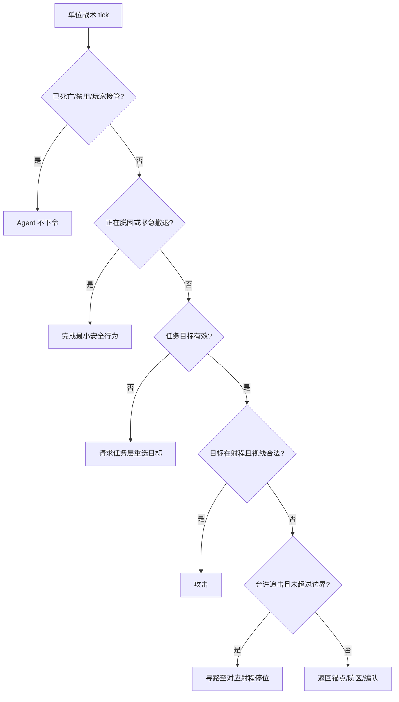

### 12.2 矿车

```text
卸矿 > 躲避致命威胁 > 近距自卫 > 继续装载/返程 > 等待采矿命令
```

矿车只能在近距威胁进入自卫半径时攻击；目标离开或威胁解除后立即恢复原采矿阶段。敌方矿车同样遵守该规则，不能被加入主攻编队。

### 12.3 工程车

```text
撤离致命威胁 > 完成已承诺的安全施工 tick > 维修 > 施工 > 返回待命区
```

工程车不主动参战。若施工位置变得非法或危险持续超过阈值，应取消路径并向任务层报告，而不是原地抖动。

### 12.4 侦察车

```text
生存与情报带回 > 路线覆盖 > 攻击脆弱孤立目标 > 参与主战
```

侦察车只有在任务明确授权或局部交换显著有利时短暂攻击，避免被低价值目标拖住。

### 12.5 突击车与导弹车

- 突击车：前排拦截、护卫后排、追击低血目标；
- 导弹车：保持最小安全距离、优先高威胁或高价值目标、避免独自前出；
- 混编时根据各自真实射程计算停位，不把全队压到同一个点；
- 目标丢失时由编队决定搜索或返回，不允许单车读取隐藏位置追踪。

## 13. 简单指挥策略模板

策略模板只设置权重、预算和进入/退出条件，不直接逐单位发命令。

### 13.1 均衡发展（默认 Normal）

| 项目 | 规则 |
|---|---|
| 经济目标 | 维持稳定矿车数和一个资源缓冲 |
| 兵种比例 | 侦察 1、突击约 55%、导弹约 45% |
| 侦察要求 | 进攻前至少更新一条主路线和目标区 |
| 进攻条件 | 有效兵力比不低于标准阈值 |
| 撤退条件 | 编队生命或有效兵力低于双阈值 |
| 转换条件 | 敌方暴露经济线时转骚扰；己方基地受袭转防守 |
| 失败恢复 | 回基地维修、补经济单位、重建混编比例 |

### 13.2 快速扩张

| 项目 | 规则 |
|---|---|
| 经济目标 | 尽早控制第二矿区并建立支援站 |
| 兵种比例 | 少量突击护卫，延后导弹规模 |
| 侦察要求 | 确认扩张路线和邻近入口没有高置信威胁 |
| 进攻条件 | 只做防御性反击和低成本机会攻击 |
| 撤退条件 | 扩张点预计无法在敌军到达前守住 |
| 转换条件 | 扩张完成转均衡；发现早期进攻转反突击 |
| 失败恢复 | 放弃外部建筑预留，保矿车和工程车回主基地 |

### 13.3 矿车骚扰

| 项目 | 规则 |
|---|---|
| 经济目标 | 不牺牲己方最低采矿效率 |
| 兵种比例 | 小型快速突击队，最多占可用战力的一部分 |
| 侦察要求 | 最近确认敌方矿区、入口和可能增援方向 |
| 进攻条件 | 目标矿车暴露，路线风险低，预计击杀收益为正 |
| 撤退条件 | 敌方主力接近、超时或目标撤入基地火力区 |
| 转换条件 | 骚扰打开主路线时转主攻 |
| 失败恢复 | 小队脱离后归入主力，不连续重复同一路线 |

### 13.4 远程火力

| 项目 | 规则 |
|---|---|
| 经济目标 | 为高价导弹车保留生产预算 |
| 兵种比例 | 突击前排 45%、导弹后排 55%，保留侦察 |
| 侦察要求 | 持续确认敌方前排和侧翼路线 |
| 进攻条件 | 前排足以保护后排，且有安全射击位置 |
| 撤退条件 | 前排崩溃、导弹车被贴近或路线被包围 |
| 转换条件 | 敌方大量快速单位时增加突击车 |
| 失败恢复 | 导弹车优先撤离，重建前排后再出击 |

### 13.5 基地龟缩

| 项目 | 规则 |
|---|---|
| 经济目标 | 安全矿区、维修和支援站优先 |
| 兵种比例 | 以突击拦截和导弹后排为主 |
| 侦察要求 | 只侦察入口、敌方集结点和最近扩张 |
| 进攻条件 | 只在击退敌军后有限追击 |
| 撤退条件 | 永不为追击离开防守边界太远 |
| 转换条件 | 敌方经济明显领先或攻势失败后转反攻 |
| 失败恢复 | 收缩防区、保护工程车、集中修复关键建筑 |

### 13.6 反突击防守

| 项目 | 规则 |
|---|---|
| 经济目标 | 暂停非关键扩张，保留补兵与维修预算 |
| 兵种比例 | 按已观察敌军组成即时调整 |
| 侦察要求 | 追踪敌军主力方向，不追求全图覆盖 |
| 进攻条件 | 敌军撤退且局部兵力优势明显时反击 |
| 撤退条件 | 不跨越设定反击距离 |
| 转换条件 | 威胁解除转均衡或侦察后主攻 |
| 失败恢复 | 放弃外围资产，集中守指挥中心与生产建筑 |

### 13.7 侦察后主攻

| 项目 | 规则 |
|---|---|
| 经济目标 | 保持常规生产，不提前耗尽资源缓冲 |
| 兵种比例 | 按侦察到的敌方组成动态计算 |
| 侦察要求 | 目标、至少一条路线、敌方主力最近位置均达置信阈值 |
| 进攻条件 | 情报和兵力同时达标 |
| 撤退条件 | 情报失效且遭遇兵力显著超预期 |
| 转换条件 | 发现经济缺口转骚扰；发现空基地转快速主攻 |
| 失败恢复 | 撤回、更新情报、修正敌军估值后再计划 |

### 13.8 残局总攻

| 项目 | 规则 |
|---|---|
| 经济目标 | 只保留能在预计决胜时间内产出的投入 |
| 兵种比例 | 使用所有可战单位，仍排除矿车和必要工程车 |
| 侦察要求 | 确认敌方最后指挥中心位置或可靠最后已知位置 |
| 进攻条件 | 敌方关键生产已毁、己方经济即将枯竭或换家可胜 |
| 撤退条件 | 仅在无法造成决定性伤害且仍可恢复时撤退 |
| 转换条件 | 敌方重建经济成功则回到恢复/均衡 |
| 失败恢复 | 保护最后生产能力，避免把经济单位送入战斗 |

## 14. 难度系统

### 14.1 原则

难度首先改变“决策质量、节奏和并行能力”，而不是改变单位规则。四档建议：

| 参数 | Easy | Normal | Hard | Expert |
|---|---:|---:|---:|---:|
| 战略决策间隔 | 50 tick | 35 tick | 25 tick | 20 tick |
| 战术决策间隔 | 8 tick | 5 tick | 3 tick | 2 tick |
| 反应延迟 | 18—30 tick | 10—18 tick | 5—10 tick | 2—6 tick |
| 接触记忆半衰期 | 短 | 标准 | 较长 | 长，但仍会失真 |
| 目标评分噪声 | 高 | 中 | 低 | 很低 |
| 同时战斗任务 | 1 | 1 | 2 | 3 |
| 生产规划深度 | 当前缺口 | 当前+下一单位 | 组合补齐 | 组合+预算窗口 |
| 路线评估 | 最短可达 | 距离+已知威胁 | 多候选路线 | 多路线+佯攻转向 |
| 集火质量 | 偶尔分散 | 按威胁优先 | 过量伤害控制 | 编队级火力分配 |
| 撤退 | 迟缓且不稳定 | 标准双阈值 | 更早保护高价单位 | 按单位价值分层撤退 |
| 侦察覆盖 | 低 | 关键区域 | 主路线+扩张点 | 主路线+反侦察复查 |

参数应存于数据资源，例如 `EnemyDifficultyProfile`，而不是散落在 Agent 常量中。

### 14.2 公平性边界

默认所有难度禁止：

- 全图视野；
- 隐藏目标的精确实时追踪；
- 免费资源、免费单位或瞬间完工；
- 跳过建造、生产、路径和命令验证；
- 为敌军单独增加伤害、射程、速度或生命；
- 根据玩家输入事件而不是阵营可见结果进行“读操作”反制。

如果未来为无障碍或极限挑战加入资源倍率，必须在难度说明中明确显示为“经济加成”，并与智能参数分开。测试基准默认关闭经济作弊。

### 14.3 难度应产生的体感

- Easy：给玩家反应时间，会犯可理解的目标选择错误，不擅长多线；
- Normal：完成完整经济、侦察、集结、进攻、撤退循环；
- Hard：会根据观察到的兵种调整生产，保护高价值单位并从较安全路线进攻；
- Expert：能同时维持侦察、骚扰和主力任务，会通过佯攻或转向制造压力，但信息仍然公平。

## 15. 评分、滞回与防抖

### 15.1 统一评分规范

所有评分先归一化到 `0..1` 或明确的战力单位，再乘配置权重。不得混用未归一化的距离、造价和生命值。

建议的有效战力：

```text
effective_power(unit) = base_combat_value
                      * health_ratio
                      * readiness
                      * matchup_modifier
                      * support_modifier
```

区域威胁是可见/可信接触的有效战力按距离与置信度衰减后的总和。

### 15.2 切换成本

新候选只有满足以下条件才替换当前选择：

```text
new_score > current_score + switch_margin + commitment_cost
```

其中 `commitment_cost` 随已经投入的移动时间、生产进度和暴露风险增加，随任务停滞而下降。

### 15.3 必须配置的防抖项

- 战略状态最低驻留 tick；
- 相同命令重发冷却；
- 目标切换优势阈值；
- 进攻/撤退双阈值；
- 侦察点重复访问惩罚；
- 路径失败重试上限和退避时间；
- 建造位置失败黑名单有效期；
- 单位卡住恢复的最大次数；
- 最后已知目标搜索时间上限；
- 防守追击半径和返回缓冲区。

## 16. 可解释性与 UI

我方 AI 的每个开放任务至少显示：

- 谁下达、谁负责；
- 当前目标与地图位置；
- 当前阶段和参与单位数；
- 预算/预留资源；
- 最近一次关键决定及原因；
- 是否被玩家接管、资源、生产槽、路径或情报阻塞；
- 暂停、恢复、取消、接管和归队操作。

左侧工作流应按并行活动汇总，例如：

```text
采矿 3    施工 1    维修 0
侦察 1    防守 4    进攻 6
```

展开后才显示任务明细，避免重新覆盖左上 HUD。底部命令台显示当前选中单位的合法命令，不兼容命令应禁用并给出短原因。

敌方 AI 的详细内部信息只进入 `F3` 调试层，普通玩家仅通过可观察行为判断。调试层建议显示：

- 难度与战略模板；
- 战略状态和已驻留 tick；
- 经济/威胁/兵力摘要；
- 活跃任务、目标分数和拒绝原因；
- 真实状态与阵营知识的差异计数；
- 每秒评估节点数和命令数。

## 17. 性能与确定性预算

10 Hz 模拟下建议：

- 每 tick 只运行单位安全层和已经分摊的少量战术更新；
- 战略和任务更新按 Agent 错峰，避免同 tick 峰值；
- 区域威胁图按事件增量更新或低频重建；
- 路线候选最多评估 2—4 条，不为每个单位重复全图搜索；
- 编队共享主路线，单位只计算局部射程停位和脱困；
- 目标评分候选先按可见性、距离和类型粗筛；
- 每个 Agent 设置每 tick 最大评估数与最大命令数；
- 所有字典遍历在影响决策前使用稳定 ID 排序。

性能目标：标准 1v1 垂直切片中，AI 决策不应造成权威 tick 超预算；相同种子、输入和配置产生相同命令序列。

## 18. 测试与验收矩阵

### 18.1 权限和公平性

| 场景 | 验收标准 |
|---|---|
| 玩家接管 Agent 单位 | 后续 Agent 命令不能覆盖；归队前一直保留玩家控制 |
| 混合单位攻击 | 只调动作战单位，矿车和工程车继续原任务 |
| 新单位生成 | 符合开放任务角色时可加入；玩家也能立即选择和命令 |
| 隐藏敌军移动 | AI 只到最后已知位置，搜索失败后停止追踪 |
| 资源不足 | AI 命令被正常拒绝或排队，不产生负资源 |
| 非法建造点 | AI 重选合法点，不直接生成建筑 |

### 18.2 战术行为

| 场景 | 验收标准 |
|---|---|
| 射程外锁定目标 | 单位寻最短合法路线追至自身射程后攻击 |
| 移动目标 | 在重寻路冷却后更新路径，不每 tick 抖动 |
| 防守诱敌 | 超出防守追击边界后停止追击并返回 |
| 远近程混编 | 突击车前排、导弹车按射程停位 |
| 低生命编队 | 进入撤退后不会因单 tick 波动立即折返 |
| 目标死亡 | 清理锁定、编队接触和展示痕迹，重新选敌或结束任务 |

### 18.3 经济与战略

| 场景 | 验收标准 |
|---|---|
| 矿车损失 | 在预算允许时补产并分配本阵营矿区 |
| 工厂受损 | 安全时分配工程车，危险时先撤离或防守 |
| 第二矿区高风险 | AI 延后扩张并优先侦察/护卫 |
| 玩家大量导弹车 | Hard/Expert 在观察确认后提高突击/骚扰权重 |
| 进攻时基地受袭 | 根据到达时间和换家胜率决定回防，不是无条件全撤 |
| 攻击失败 | 撤退、维修、补员后才能再次达到进攻门槛 |

### 18.4 难度对比

每个难度在固定种子组上至少运行 20 局自动对战或脚本场景，记录：

- 首次侦察、首次扩张、首次交战时间；
- 平均闲置矿车时间；
- 资源浮余和生产槽空闲率；
- 有效伤害/承受伤害；
- 目标切换次数和无效命令率；
- 撤退成功率和高价值单位保存率；
- 可见信息利用率与隐藏真值违规次数；
- 胜率和平均对局时长。

难度不要求胜率严格单调于每个种子，但聚合结果应体现更高档决策效率上升，且隐藏真值违规始终为 0。

## 19. 实施顺序

### 阶段 A：决策基础设施（下一阶段）

1. 新增数据化 `AgentPolicy` 与 `EnemyDifficultyProfile`；
2. 建立统一的阵营态势摘要、接触记忆和评分工具；
3. 为任务增加优先级、最低承诺时间、决策原因和资源预留；
4. 将 `EnemyRaidAgent` 常量迁移到 Normal 难度配置，保持现有测试行为；
5. 增加决策日志和隐藏真值访问防线测试。

### 阶段 B：基础战术完善（下一阶段）

1. 实现保持位置、巡逻、护卫和可配置追击距离；
2. 增加防守半径、有限追击和返回状态；
3. 建立前排/后排射程停位、集火与过量伤害控制；
4. 统一敌我单位战术控制器，参数和授权不同，规则相同；
5. 补齐单位维修、支援站范围维修/补给与撤退目标选择。

### 阶段 C：并行任务与我方授权（下一阶段后半）

1. 从同域单任务升级为任务图和资源/单位租约；
2. 支持独立侦察队、守备队、骚扰队和主力队；
3. 实现 `ADVISORY / ASSISTED / DELEGATED` UI 与持久设置；
4. 完成任务建议、接受、拒绝、暂停、取消、接管和归队反馈；
5. 新生产单位按角色、任务需求和玩家保留设置进入编队。

### 阶段 D：难度与策略（后续）

1. 上线 Easy/Normal/Hard 三档，Expert 先作为调试档；
2. 增加路线威胁评分、兵种观察与反制生产；
3. 实现均衡、快速扩张、矿车骚扰、反突击四个模板；
4. 加入多种固定种子回归、长时经济恢复和压力测试；
5. 人工试玩校准反应时间、进攻门槛、撤退阈值和任务并发数。

### 阶段 E：长期增强

1. 战略画像混合和对手模型；
2. 佯攻、转向、侧翼和多方向同步；
3. 基于历史对局的离线参数调优，但运行时仍使用确定性规则；
4. 为多人联机复用相同权威命令与阵营知识边界；
5. 在不改变规则公平性的前提下扩展更多单位、科技和地图。

## 20. 首轮推荐交付范围

为了避免一次性重写现有八阶段 AI，首轮实现已按以下范围完成：

1. 数据化四档难度，先让反应时间、决策间隔、撤退阈值、评分噪声生效；
2. 增加目标评分和路线风险评分，并保证只读取阵营知识；
3. 实现防守追击边界、攻击追击上限和双阈值撤退；
4. 增加敌方兵种配比对已观察玩家兵种的简单反制；
5. 为我方工业主管、战场将领加入 `ADVISORY / ASSISTED / DELEGATED / AUTONOMOUS` 权限检查与基础自主任务；
6. 在现有左侧工作流中展示权限、任务原因和阻塞原因；
7. 使用固定种子确保 Normal 难度仍能完成现有八阶段垂直切片。

这组范围已经在保留八阶段成功路径的前提下改善敌方智能和我方 AI 可控性，下一轮进入多编队并行、更多战术命令和复杂策略模板。

## 21. 完成定义

基础 AI 阶段只有同时满足以下条件才算完成：

- 玩家能够清楚设定我方 Agent 权限，且直接命令从不被覆盖；
- 新旧单位遵守同一角色与任务规则；
- 敌方至少三档难度具有可感知、可测量的行为差异；
- 敌方能持续完成采矿、补员、侦察、防守、进攻和失败恢复；
- 远程攻击、追击、防守边界和撤退没有明显抖动；
- 敌我双方使用同一命令验证、寻路、战斗、生产和维修规则；
- 战争迷雾测试证明敌方没有读取隐藏真值；
- 决策日志能够解释“为什么做、使用了什么信息、为何停止”；
- 固定种子自动测试、6 分钟垂直切片和人工试玩均通过。
