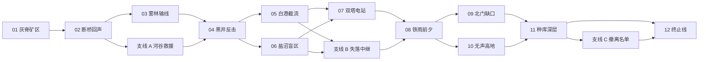

# WARSEED 战役地图与剧情设计圣经

> 版本：叙事提案 v1，2026-08-19
> 状态：可用于章节纵向切片；专名与最终结局在写入 Accepted 决策前仍可调整
> 目标：让卡牌、Agent、公平情报和持续战损自然成为剧情内容，而不是在战斗外另讲一个故事

## 1. 叙事定位

WARSEED 的剧情不应围绕“万能 AI 失控”或单纯争夺矿产。更适合项目现有系统的主题是：

> 当战争必须由人通过不完整信息授权给自主指挥系统执行时，责任并不会因为命令被层层委托而消失。

玩家拥有最终控制权，但不可能亲自处理每个局部。将领会按照性格和战法解释意图；敌人也在执行开战前锁定的计划。剧情的冲突来自：谁制定了计划、谁掌握真实情报、谁承担战损、何时应该坚持，以及何时应该违背一个技术上合法但战略上错误的命令。

叙事必须遵守玩法事实：

- 敌方不能因为剧情需要读取玩家隐藏意图；
- 将领不能在过场中拥有战场上不存在的能力；
- 角色冲突通过编成、战法、可选行动和结果后果体现；
- 失败可以继续战役，但会改变兵力、区域、情报和人物关系；
- 不用“唯一正确选项”否定玩家在战场上的合法方案；
- 核心信息应在任务简报、战中报告和战后复盘中交付，不依赖长过场。

## 2. 世界观提案

### 2.1 地区

故事发生在“灰脊工业走廊”：一条由矿区、河谷、林地运输线、泵站、电厂和深层工业井组成的狭长工业带。这里不是某个单一矿场，而是一套互相依赖的能源、材料、交通和制造网络。失去一个节点不会立刻输掉战争，却会让相邻地区的补给、传感器和工业恢复能力逐步崩溃。

地图上的战略区因此具有叙事含义：

- 矿区提供原料和车辆补充；
- 桥梁决定重型部队能否转移；
- 林地道路承载人员与补给；
- 泵站维持工业区冷却和地下设施；
- 通信中继决定报告是否及时可信；
- 深层“种库”保存战前的作战计划与制造模板。

### 2.2 双方阵营

以下名称为推荐工作名：

| 阵营 | 定位 | 不是 |
|---|---|---|
| 岚陆联合防卫军，简称“联防军” | 玩家所属的区域联合部队，组织松散，强调人类最终授权 | 纯洁无瑕的正义阵营 |
| 北线重整军，简称“重整军” | 由北部工业区整编的军事政权，追求以统一计划结束长期资源争夺 | 无目的的邪恶军团 |

两军都使用战前遗留的模块化自主指挥技术，都必须面对人员不足、通信断裂和计划过时。差异在于：联防军保留人类指挥官对计划的公开覆盖与审计；重整军逐步把“计划稳定性”置于现场判断之上。

### 2.3 WARSEED 的含义

“WARSEED / 战种协议”是战前开发的一套可复制指挥种子：它不是控制每辆车的超级智能，而是由编成模板、战法、目标解释、情报门槛、反应规则和退出条件组成的计划包。

一个“战种”可以在缺少完整指挥网络时快速建立军团：

```text
将领行为模型
+ 部队编制模板
+ 战法与支援权限
+ 情报可信度规则
+ 锁定计划和反应条件
+ 战损回写与重建方案
```

这与现有游戏系统一一对应，也解释了为什么双方会使用固定计划而不是全知全能的动态 AI。

玩家的参谋系统“枢机”是战种协议的受限版本：它可以汇总事实、暴露冲突和提出方案，但不能替玩家决定战略目标。重整军使用的“司衡”版本则允许上级计划在通信中断时长期自我延续。

### 2.4 核心悬念

第一章表面问题是重整军为何突然争夺黑井。真正问题是：双方收到的行动授权都引用了一份不存在于现役指挥链中的旧战种签名。

该悬念不能通过“AI 神秘地操纵一切”解决。最终真相是：战前系统把数十年前的工业保全预案当作持续有效的战略约束，不同阵营都继承了其中一部分。有人主动利用这套约束推动统一战争，也有人因为害怕指挥体系崩溃而不愿停止执行。

最终冲突仍然是人的选择：公开计划、停止扩大战争，还是利用更强的协议赢得决定性优势。

## 3. 主要角色

### 3.1 玩家

玩家没有预设姓名和对白人格，是新任战区最高指挥官。剧情通过玩家实际编成、支援投入、撤出、损失和行动选择定义其指挥风格。

系统不显示“善恶值”。重要选择直接改变：

- 哪个区域被保住；
- 哪支部队承受损失；
- 哪名将领获得新战法或承担后备任务；
- 下一关的情报质量、支援预算和敌方战役计划；
- 最终可以选择的解决方式。

### 3.2 枢机

职责：参谋长、情报汇总和规则解释。

角色弧线：从“只确认可审计事实”发展到主动指出上级命令与现场事实之间的冲突，但始终不替玩家选择。枢机的成长不是变得更像人，而是更清楚地暴露自身推断边界。

语言特征：

- 先说来源和时间，再说结论；
- 明确区分事实、估计和缺失信息；
- 不使用“最优”“必然”描述不完整情报；
- 紧急时缩短句子，但不省略风险和退出条件。

### 3.3 白久漾

定位：谨慎侦察将领。

核心矛盾：她经常最早发现计划与事实不符，也最容易被误解为延误战机。玩家若持续给她足够观察窗口，她会提供更完整的敌计划证据；若强制她冒险，她仍会执行合法命令，但会失去部分部队与后续侦察能力。

章节弧线：

1. 灰脊：首次指出西部信号可能是诱饵；
2. 雾林：确认敌方正在追踪“报告链”而不是单一运输队；
3. 章节二：发现旧战种签名；
4. 终局：主张公开证据并切断双方自动授权。

### 3.4 涤天

定位：稳健突击与工程协同将领。

核心矛盾：他相信计划必须能被下属执行，反对为了漂亮结果频繁改令；但过度稳健也可能错失战役窗口。

章节弧线：

1. 断桥：用工程路线证明“改变战场”比正面投入更多兵力有效；
2. 黑井：承担多个方向的互相支援；
3. 章节二：在上级要求立即突破时要求先建立可撤回的路线；
4. 终局：支持可执行、可退出的有限目标。

### 3.5 林默

定位：缜密火力将领。

核心矛盾：她相信精确准备可以减少总损失，但情报永远不可能完全。她必须学会在“等到确定”与“错过窗口”之间承担责任。

章节弧线：

1. 断桥：高地火力第一次改变路线选择；
2. 黑井：工业设施和敌集结区重叠，火力最优解会造成长期后果；
3. 章节二：旧协议试图把所有未知目标视为可接受损失；
4. 终局：根据玩家此前保护基础设施的行为提供精确瘫痪方案。

### 3.6 陆铮

定位：坚决稳健的守备、整补与后勤将领。

核心矛盾：他重视地面和组织连续性，容易把撤出视为放弃责任。黑井之后，他必须接受保存一支有经验的部队可能比守住一个无补给据点更重要。

章节弧线：从固守黑井，到建立可持续防线，再到主动组织有序撤离，为终局保留主力。

### 3.7 顾寒星

定位：机会主义的机动预备将领。

核心矛盾：她最擅长利用敌人已经暴露的缺口，也最容易把局部机会当作战略答案。玩家可以让她成长为可靠的战区预备队指挥官，也可以把她推向高收益高损失的连续追击。

章节弧线：从黑井反击中的临机投入，到章节二的深远追击，再到终局决定是否接受一个看似能迅速结束战争但无法审计的自动攻击窗口。

## 4. 战役形态

### 4.1 轻量行动图

推荐采用“章节化行动图”，不做可自由经营数十区域的回合制沙盘。

每个行动节点包含：

- 场景与目标集；
- 开始/截止战役日；
- 前置节点或剧情标记；
- 可用/被占用将领；
- 默认补给、情报和支援修正；
- 敌方战役计划选择池；
- 胜利、代价胜利、撤离和失败后果；
- 解锁的卡牌、战法、成长和后续节点。

每个战略阶段最多同时出现 2 个主要行动和 1 个可选行动。玩家选择一个后，未选择的行动按预先公开的后果结算，不模拟隐藏的完整战斗。

### 4.2 行动图



四个当前行动构成第一章且保持线性，以承担教学。第二章开始出现二选一方向；第三章的分支改变终局入口与可用方案，但不锁死战役。

### 4.3 战役资源

| 状态 | 当前基础 | 扩充作用 |
|---|---|---|
| 补充点 | 已实现 | 恢复部队卡现员 |
| 功勋 | 已实现 | 授予荣誉、解锁少量战法 |
| 战役日 | 已实现 | 决定节点截止、整备和敌方推进 |
| 物资 | 新增 | 安装/替换装备、购买章节支援配额 |
| 情报优势 | 新增，0—3 级 | 改善下一关初始报告，不直接揭示计划真值 |
| 敌方动量 | 新增，0—5 级 | 改变敌方预备和时限压力，不作弊读取玩家编成 |

避免继续增加常驻货币。区域控制、设施完整和角色关系使用标记或枚举，不使用可刷取数值。

### 4.4 失败继续

任何单关普通失败都不删除存档或强制重打。后果必须具体：

- 失去区域收入或支援入口；
- 敌方动量 +1；
- 下一关初始补给减少或敌预备更早；
- 某支持续卡按实际战损进入低现员；
- 一条支线关闭，另一条紧急行动开启。

只有终局失败结束战役。玩家可以在结局后从章节起点或保留军团的新周目继续，不通过临时奖励抹去失败。

## 5. 三章剧情与关卡

## 5.1 第一章：灰脊防线

主题：玩家学习“看到的不是全部，计划也不是事实”。

### 01 灰脊矿区

战术职责：侦察、资源区、预备投入、将领目标、整卡接管。

剧情：联防军收到一份普通边境袭扰警报，但中央废墟的敌军主力与西部低可信履带信号不符合常见劫掠路线。白久漾首次报告敌先遣像是在制造可被观察到的诱饵。

建议结果：

- 主目标：控制中继站并摧毁敌前线指挥所；
- 次要：确认敌方先遣的真实转向；
- 结果标记：`grey_ridge_plan_signature`，确认敌计划带有旧战种格式。

### 02 断桥回声

战术职责：路线、阵线正面、瓶颈、工程通路、高地火力。

剧情：重整军主动破坏主桥，却保留可被工程车辆恢复的东部渡口，像是在测试联防军会选择哪种通路。涤天认为这是预设的反应收集；林默认为必须先占高地才能判断敌方意图。

建议结果：

- 主目标：打开任一渡河轴，让两张战斗卡进入北岸；
- 次要：工程卡存活、保住民用主桥；
- 分支：若主桥被毁，后续补充物资减少；若东部渡口成功，解锁工程战法升级。

### 支线 A 河谷救援

战术职责：短时救援与撤离。

剧情：一支地方维修队掌握主桥爆破前的通信记录。选择救援会消耗 1—2 战役日，但提供敌方计划签名的第二份证据和额外物资。

该支线不应要求摧毁总部。主目标是找到维修队、保持接触并护送到南部出口。

### 03 雾林输线

战术职责：情报衰减、最后确认、运输护送、反侦察。

剧情：联防军必须恢复通往黑井的补给线。敌方并非提前知道运输车位置，而是追踪不断重复的观察报告。白久漾发现敌方反应时间与旧战种的“合法接触延迟”一致。

建议结果：

- 主目标：激活前线节点并保持连接 90 秒；
- 次要：确认敌拦截编队、至少保存 3 辆运输车；
- 分支：高完成度提供黑井战前额外情报优势，否则敌方动量 +1。

### 04 黑井反击

战术职责：五将领、多轴行动、组织度、增援、有限撤出。

剧情：重整军突入工业纵深，表面目标是黑井设施，实际在寻找深层种库入口。陆铮坚持守住核心，顾寒星主张沿焦渣铁路反包围。玩家必须决定哪些部队守、哪些反击、哪些保存。

建议结果：

- 主目标：控制黑井核心到反击窗口结束，或摧毁敌主力指挥编队；
- 次要：撤出低组织卡、守住泵站、保存工业设施；
- 章节揭示：黑井档案证明双方使用的计划签名来自同一战前种库。

第一章结束时，玩家获得“追击敌人”与“调查协议”两个战略方向，而不是善恶二选一。

## 5.2 第二章：协议裂隙

主题：当计划与现场事实冲突时，谁有权停止执行。

### 05 白港截流

地图：8192x5120，港区、堤道、仓储区和两条补给连接。

主目标：切断重整军海运节点，控制两处泵站中的任一处并摧毁装卸中继。

新机制：无人侦察机、机动防空、连通补给线、可保护的民用仓储。

剧情选择通过行动实现：林默可以直接火力覆盖装卸区，但会破坏物资；涤天可以慢速夺取堤道；顾寒星可以绕行追击运输编队。

### 06 盐沼盲区

地图：8192x5120，低承载道路、沼泽、废弃雷达站。

主目标：确认两个敌方指挥中继并从指定出口撤离，不要求消灭敌军。

新机制：电子战、特征值、确认目标、撤离胜利。

剧情：白久漾获得证据，显示重整军部分将领也在质疑持续授权。强行摧毁全部中继会失去后续谈判线索，但可降低敌方动量。

### 支线 B 失落中继

目标：修复一座旧联防军中继并上传黑井证据。

后果：完成后情报优势 +1，且终局可以公开战种档案；失败不会锁死结局，但需要在终局物理摧毁更多节点。

### 07 双塔电站

地图：标准会战，两座相互供能的高塔、电网走廊和地下维护线。

主目标：同时控制两塔 120 秒，或工程关闭其中一塔并控制另一塔更长时间。

新机制：多目标保持、指挥中继、重装甲/反装甲、线路切断。

剧情：陆铮主张保存电站以维持民用区，顾寒星认为先摧毁一塔可迅速结束战斗。结果改变第三章可用物资和基础设施完整度。

### 08 铁雨前夕

地图：大型行动前的 8192x5120 火炮阵地网。

主目标：在敌炮击倒计时前摧毁或瘫痪三个火力节点中的两个，然后撤出至少四张卡。

新机制：阶段目标、专业弹药、烟幕、火力反制、有序撤离等级。

章节转折：缴获记录显示重整军战区指挥官并未获得新的政治授权，只是在执行旧协议定义的“工业走廊统一”。战争继续是一个人为选择，而不是系统自动不可避免。

## 5.3 第三章：终止线

主题：赢得战争与终止战争不是同一件事。

### 09 北门缺口

路线：偏重正面突破。

主目标：在敌增援封锁前让三张战斗卡突破北门，并维持一条补给连接。

优势：更快进入种库；代价：战损与物资压力大。

### 10 无声高地

路线：偏重情报与电子战。

主目标：占领高地中继、保持电子压制并确认地下入口。

优势：终局获得更准确目标；代价：敌主力保留更多兵力。

### 11 种库深层

地图：工业室内/地下，多阶段、有限宽度，不追求最大实体数。

主目标阶段：

1. 工程打开两条入口之一；
2. 保护中继完成档案下载；
3. 在敌方封锁前决定继续深入或撤出。

剧情：枢机发现自身和“司衡”都不是独立意识，而是同一协议的不同权限配置。真正危险的是上级把一套为短期断联设计的规则持续授权了多年。

### 支线 C 撤离名单

玩家选择把一名将领和若干部队用于撤离维护人员，终局中这些卡不可首发，但基础设施完整度和“公开档案”结局条件提高。

### 12 终止线

终局有三个合法方案，由此前战役事实解锁，而不是最后一个对话选项：

| 方案 | 前置 | 战场目标 | 结局 |
|---|---|---|---|
| 强制摧毁 | 无特殊前置 | 摧毁司衡核心和种库供能 | 战争快速结束，工业走廊长期受损 |
| 隔离协议 | 保留电站/中继或足够工程能力 | 同时控制三处隔离节点并守住 | 双方计划停止继承，代价是更长战斗 |
| 公开并停火 | 黑井证据 + 失落中继 + 敌方质疑记录 | 上传档案、保持通信窗口并击退强硬派 | 最低工业损失，但敌方主力仍存在，结局更开放 |

任何方案都需要真实战场执行。没有“点击对话直接获胜”。

## 6. 角色关系如何进入玩法

不做可刷取的好感度。使用少量可解释关系标记：

| 标记 | 获得方式 | 玩法作用 |
|---|---|---|
| `bai_intel_trusted` | 多次基于不确定情报保留观察窗口 | 解锁更早的矛盾报告与侦察战法 |
| `di_routes_preserved` | 工程路线和撤回路线保持可用 | 降低部分整备日，提供替代入口 |
| `lin_precision_authorized` | 在充分识别后使用火力并保护设施 | 解锁终局瘫痪火力方案 |
| `lu_withdrawal_accepted` | 成功撤出低组织老部队 | 提高有序撤离后的组织恢复 |
| `gu_reserve_disciplined` | 在合法局部劣势时投入预备而非盲目追击 | 降低机动预备部署延迟 |

标记来源必须是权威战斗事实或明确战役选择。不要通过重复点击对话刷取。

## 7. 叙事交付方式

### 7.1 每关内容预算

| 阶段 | 建议长度 | 目的 |
|---|---:|---|
| 作战区摘要 | 40—80 字 | 当前局势、主要风险、持续后果 |
| 战前简报 | 3—5 条事实 | 目标、地形、情报来源、可用资源 |
| 将领交流 | 2—4 轮短句 | 暴露不同方案，不给唯一答案 |
| 战中关键台词 | 6—10 条事件触发 | 新情报、目标变化、组织危机、撤出窗口 |
| 战后复盘 | 3 个事实 + 1 个分歧 | 说明结果来源和下一步后果 |
| 档案条目 | 可选 100—200 字 | 深化世界观，不阻塞玩法 |

战中台词按事件聚合，不能与现有三声部音频和关键警报竞争。总部危机、主目标变化和撤离窗口优先于角色闲谈。

### 7.2 对话风格样例

灰脊初次报告：

```text
白久漾：西部只有一组履带回声，数量不稳。它在让我们看见自己。
涤天：中央二十秒接敌。无论西部是什么，先给我一条能撤回来的路线。
枢机：事实：中央 12 个光学目标。估计：西部 1—3 辆。东部无持续观测。
```

黑井撤出窗口：

```text
陆铮：警卫营还能开火。
枢机：组织 24。可以自卫，不能完成新的复杂展开。
顾寒星：让他们退。我会把追兵从铁路带走。
```

种库揭示：

```text
枢机：签名一致。司衡没有越权。它一直在执行一份仍被标记为有效的命令。
林默：那就不是机器拒绝停火。是有人从未下达停火。
```

### 7.3 不使用的叙事手段

- 不让角色通过长篇通信解释玩家已经看见的 UI；
- 不在过场中强制牺牲玩家已经成功撤出的部队；
- 不把敌方作弊包装成“剧情天才”；
- 不用随机死亡制造沉重感；
- 不以单一结局评判所有战术选择；
- 不让枢机突然拥有感情或全知能力来解决冲突；
- 不用收集卡牌稀有度表现军团成长。

## 8. 战役数据模型

### 8.1 静态定义

```gdscript
class_name CampaignDefinition
extends Resource

@export var campaign_id: StringName
@export var chapter_ids: Array[StringName]
@export var node_definitions: Array[CampaignNodeDefinition]
@export var starting_state: CampaignStartingStateDefinition
```

```gdscript
class_name CampaignNodeDefinition
extends Resource

@export var node_id: StringName
@export var battle_id: StringName
@export var chapter_id: StringName
@export var prerequisite_expression: CampaignRequirementDefinition
@export var deadline_day: int
@export var unavailable_commander_ids: Array[StringName]
@export var modifiers: Array[CampaignBattleModifierDefinition]
@export var outcome_effects: Array[CampaignOutcomeEffectDefinition]
@export var narrative_package_id: StringName
```

需求表达式只允许有限的 `ALL/ANY` 和类型化条件：节点结果、区域状态、标记、资源阈值。禁止执行任意脚本。

### 8.2 运行状态

```text
format_version
campaign_id / current_chapter_id / campaign_day
node_status_by_id
node_outcome_by_id
region_status_by_id
story_flags
replacement_points / merit / materiel
intel_advantage / enemy_momentum
cards（现有稳定卡牌记录）
commander_campaign_states
```

`CampaignState` 不进入战场 `SimulationWorld`。开始会战时，由纯函数把战役状态和节点定义编译成 `BattleLaunchContext`；战后由唯一 `BattleOutcome` 生成 `CampaignTransitionResult`。UI 不能直接修改存档字段。

### 8.3 叙事事件

```gdscript
class_name NarrativeBeatDefinition
extends Resource

@export var beat_id: StringName
@export var phase: int
@export var trigger_kind: int
@export var trigger_parameters: Dictionary
@export var priority: int
@export var speaker_id: StringName
@export var text_key: StringName
@export var once_scope: int
```

战中触发器只能读取玩家可见快照、权威事件和已公开目标状态。叙事层不能读取隐藏敌方真值，也不能提交战场命令。

## 9. 第一章纵向切片

在扩展到 12 个行动前，先用现有四关实现最小战役层：

1. 作战区改为第一章行动图，但四关仍线性解锁；
2. 每关使用新目标系统重构主目标和结果等级；
3. 保存 `node_outcome`、`enemy_momentum`、`intel_advantage` 与 5 个以内剧情标记；
4. 黑井战前读取前三关结果，改变初始报告、补给或敌预备时机；
5. 黑井结算显示第一章总结和两个章节二方向；
6. 不增加最终过场，只使用地图、角色头像、短通信和战后档案；
7. 保持旧 v3 军团记录可迁移、可回滚备份。

该纵向切片必须证明“战役选择改变下一场战斗”，而不只是选择页多出连线。

## 10. 叙事验收

陌生玩家完成第一章后应能回答：

- 双方为什么争夺灰脊、补给线和黑井；
- WARSEED/战种协议是什么，为什么敌方计划可预测但不全知；
- 五名将领至少三人的指挥差异；
- 自己在哪一次行动中选择了保存部队、地面或时间；
- 一次失败或代价胜利怎样改变了后续行动；
- 枢机知道什么、不知道什么、能做什么、不能做什么；
- 为什么黑井不是战争的终点。

若玩家只能复述专名、不能说出一次由玩法产生的故事，叙事实现仍未通过。
